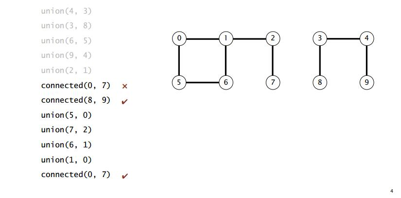
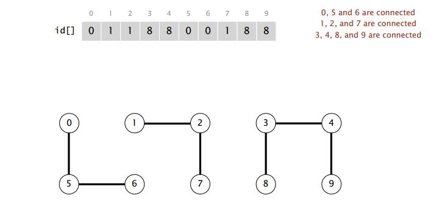
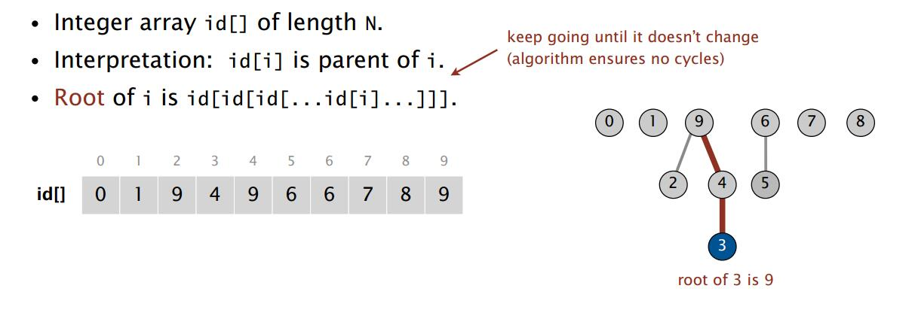
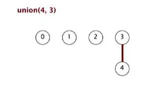
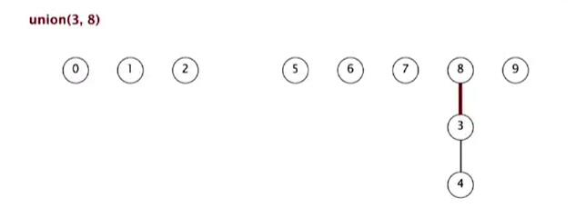
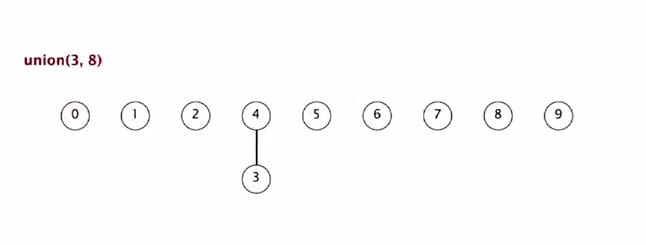
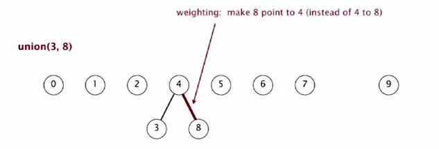
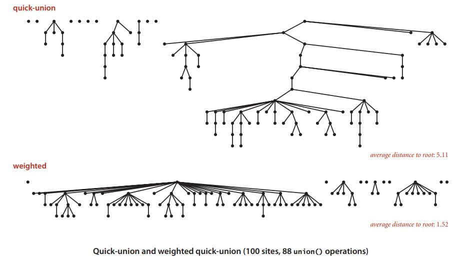

# Week1 Union−Find

### 设计一个算法的步骤

- Model the problem.建立问题基本模型，找出解决问题的基本步骤，提出粗略的方案
- Find an algorithm to solve it. 找到一个解决问题的算法
- Fast enough? Fits in memory?  算法速度够快么？内存占用情况怎么样？
- If not, figure out why. 如果算法不够好，找除原因在哪
- Find a way to address the problem.  寻找定位问题的方法并改进问题
- Iterate until satisfied. 循环下去直到满意为止


### 动态连通性问题

1. 问题说明 
  假定有一个包含N个元素的集合，我们定义两个方法: 
  `union`:连接两个元素 
  `connected`:判断两个元素是否连通
  实例如下：
  
2. 连通的性质
 - 任一元素自身是连通的，即p和p是连通的
 - 若p和q是连通的，则q和p也是连通的
 - 若p连通r，r连通q，则p连通q

3. 连通分量
> 连通分量是相互连通元素的最大的集合
> 连通分量中每个元素都是连通的，且不与其他连通分量中的元素连通

4. API设计  

  算法的设计最终是要体现到代码中去的，为了规范代码设计，我们先做好接口，即API。这是良好的编程习惯。
```java
public class UF {
    UF(int N) // 构造方法
	void union(int p, int q) // 连接p和q
	boolean connected(int p, int q) //判断p和q是否连通
	int find(int p) component identifier for p (0 to N – 1)
	int count() number of components
}
```
#### Quick-Find快速查找

这个问题的第一版解决方案是这样的：

 - 利用数组存储元素，数组值初始化为下标值
 - 连通元素时，将对应下标的元素值更改为需要连通的元素值
 - 判断是否连通： 数组中值相同的元素连通，否则不连通

例子如下：


代码实现如下： 

```java
public class QuickFindUF  {

	private int[] arr;

	public QuickFindUF(int N) {
		arr = new int[N];
		for (int i : arr) {
			arr[i] = i;   // 初始化数组，值为下标值
		}
	}

	boolean connected (int p, int q) {
		return (arr[q] == arr[q])  //返回是否连通
	}

// 记录下当前数组下标为p和q时的值
// 遍历数组，若哪项与p的id值相同，则将其值改为q的值，即连接p和q
	void union (int p, int q) {
		int pid = arr[p];
		int qid = arr[q];
		
		for (int i : arr ) {
			if (arr[i] == pid) {
				arr[i] = qid;
			}
		}  // end for
	}  // union()
}
```

**复杂度分析**

- 初始化： N
- 连接： N
- 判断是否连通: 1

连接N个元素所需要的代价为**$N^2$**，当元素个数较少时还可以接受，但元素个数多了之后就不行了，所以我们需要更好地算法。

#### Quick-Union快速联合

我们的第二版算法叫做Quick-Union。

Quick-Union算法仍然使用数组来存储数据，但在这数组数据所代表的含义有所不同。

现在将所有的数据元素看做一个树，数组中存储对应位置数据元素的根节点的位置。如下图所示：


**判断连通与否**

如上图所示，下标为3的元素的父节点为4，所以数组存储值为4，而4的根节点为9，所以数组中4对应的值为9。如此，要判断两个元素是否连通，只需要判断他们的根节点是否一致即可。


**连接元素**

连接元素只需要讲对应元素在数组中的值更改为连接的元素值，即将元素作为子节点挂在另一个元素上。

例如合并元素4和3，union(4, 3)



继续合并元素3和8， union(3,8)



如此，即可很方便的进行合并操作，所以这个算法的名字叫做“快速联合”。

**代码实现**

```java
public class QuickUnionUF {
	private int[] id;

  // 初始化数组，
	public QuickUnionUF(int N){
		id = new int[N];
		for (int i = 0; i < N; i++) 
			id[i] = i;
	}
	
  // 寻找i的根节点，即i == id[i]    当i == id[i]，i本身就是根节点；否则顺着向上找
	private int root(int i) {
		while (i != id[i]) 
			i = id[i];
		return i;
	}

  // 判断是否连通，即判断根节点是否相同
	public boolean connected(int p, int q) {
		return root(p) == root(q);
	}

  // 连接操作，将p的根节点设为q
	public void union(int p, int q) {
		int i = root(p);
		int j = root(q);
		id[i] = j;
	}
}
```

**复杂度分析**

- 初始化：N
- 判断是否连通：N
- 联合操作：$N^+$ （包含了查找根节点的操作）

看起来似乎比快速查找更不理想，所以，我们仍然需要更好的算法。

#### Weighted Quick-Union

quick-union算法的主要问题在于我们构建的树太"高"了，大大的降低了查找根节点的效率。为了降低树的高度，我们采用加权的quick-union算法作为改进版。

加权的quick-union算法仍然采取相同的措施构建树：执行联合操作时将元素作为子节点挂在父节点上。但我们做一个限制：联合时保证"小树"一定是挂在"大树"的下边。



如上图所示，现在我们执行union(3, 8)操作，本来应该是将3挂在8的下边，但现在因为4-3树比8大，所以我们不管参数的顺序而将8挂在3下边：



这样我们就可以保证在有大量节点的情况下树仍能保持一个较低的状态，从而提升查找速度。

quick-union和加权quick-union算法将100个节点合并88次的比较：



实现这个算法其实很简单：在执行联合操作前检查下树的大小就行。我们另外维护一个数组，存储树的大小：

```java
public void union(int p, int q) {
  	int i = root(p);
	int j = root(q);
    if (i == j) return;
    if (sz[i] < sz[j])     { id[i] = j; sz[j] += sz[i]; }
    else                   { id[j] = i; sz[i] += sz[j]; } 
}
```

**复杂度分析**

对于有N个节点的树，最大深度为lg N。

证明：

- 当tree1合并到tree2上时，树的深度增加1
- 因为tree1合并到tree2上，所以tree2 >=  tree1，tree1的大小至少翻倍；
- 每次翻倍深度增加1，从1到N的增长需要lg N次翻倍

**继续前行**

lg N的复杂度已经是很理想的了，但我们仍有提升的空间。仍然是很简单的思路：目前我们查找算法的消耗主要在查找根节点上，我们可以在联合是直接存储根节点的值而不是再通过父节点一层一层的寻找。

实现只需要一行代码：

```java
private int root(int i)
{
    while (i != id[i])
    {
        id[i] = id[id[i]];       // 如果不是根节店，将
        i = id[i];
    }
    return i;
}
```

**最终版的代码**

```java
public class WeightedQuickUnionUF {
	private int[] id;
    private int[] sz;
    private int count;

  // 初始化数组，
	public WeightedQuickUnionUF(int N){
        count = N;
		id = new int[N];
		for (int i = 0; i < N; i++) id[i] = i;
        sz = new int[N];
        for (int i = 0; i < N; i++) sz[i] = i;
	}
  
    public int count() 
    { return count; }
	
  // 寻找i的根节点，即i == id[i]    当i == id[i]，i本身就是根节点；否则顺着向上找
	private int root(int i) {
      while (i != id[i]) {
          i = id[i];
          id[i] = id[id[i]];
      }
		return i;
	}

  // 判断是否连通，即判断根节点是否相同
	public boolean connected(int p, int q) {
		return root(p) == root(q);
	}

  // 连接操作，将p的根节点设为q
    public void union(int p, int q) {
        int i = root(p);
        int j = root(q);
        if (i == j) return;
        if (sz[i] < sz[j])     { id[i] = j; sz[j] += sz[i]; }
        else                   { id[j] = i; sz[i] += sz[j]; } 
        count --;
    }
}
```

