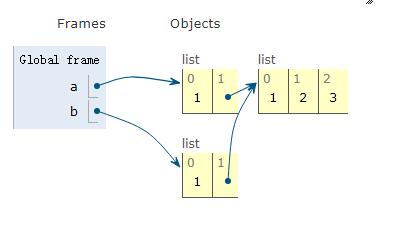
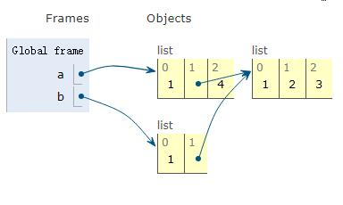
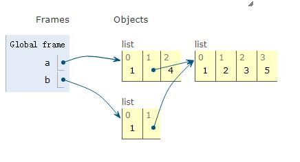

##  可变性、垃圾回收
### 别名、浅复制和深复制
先来看一个例子，假设我们要复制一个数组：
```python
a = [1, 2, 3]
b = a
```
然后我们对 b 进行修改：
```python
b.append(4)
print(a, b)
# [1, 2, 3, 4] [1, 2, 3, 4]  a 也被修改了！
```
这样的情况是我们想要的么？显然不是。我们只是想修改 b, 没想修改 a。那么为什么会出现这种情况？原因在于我们直接用等号赋值的时候，进行的是**起别名**的操作。也就是说现在 a 就是 b，b 就是 a，只是名称不一样而已。在内部结构里他们都是对同一个列表的引用。

想要达到拷贝的目的，可以这样做：
```python
b = list(a)
b = a[:]
```
这两种方法都是可以的，现在再对他们修改就不会对另一个造成影响啦。那 这种方法就是万无一失的么？再来看一个例子：

```python
a = [1, [1, 2, 3]]
b = list(a)      # 1
a.append(4)      # 2
a[1].append(5)   # 3
print(b)
##  [1, [1, 2, 3, 5]]
```

b 又被修改了！但是我们注意到，在 a 中添加的 4 并没有在 b 中出现，只是我们对 a[1]的操作体现到了 b 上边。




1. 我们将 a 复制了一份命名为 b，可以看到此时 a[1]和 b[1]都是对同一个列表的引用。

2. 向 a 中添加元素 4 时，如下图所示：

   

   此时 a 的长度变为 3，但是对 b 并无影响。

3. 继续执行向 a[1]中添加元素 5：

   

   a[1]和 b[1]共同引用的那个列表被修改了！

此时应该可以解释为什么会发生上边的情况了：使用 `list()` 构造方法或者 `[:]` 做的都是**浅复制**，只是复制了最外层的容器，副本中的元素还是源容器中元素的引用。所以会出现**修改 a 中可变元素导致 b 也被修改的情况**。

如果不想要这样的结果的话，可以使用**深复制**来解决这个问题。

```python
from copy import deepcopy
a = [1, [1, 2, 3]]
b = deepcopy(a)
a.append(4)      # 2
a[1].append(5)   # 3
print(b)
## [1, [1, 2, 3]]
```

此时就能得到我们想要的结果啦！

**总结**

1. 直接使用等号 (=) 赋值进行的是**起别名**操作
2. 利用构造方法或者[:]进行的是**浅复制**
3. 当需要复制含有可变元素的容器时，可能需要用 `copy.deepcopy` 来进行**深复制**操作

### 可变 / 不可变与 is/==

在 Python 的序列类型那篇文章中介绍了元素的可变与不可变性以及它们的区别：使用 += 操作符时，可变对象会直接修改原对象，而不可变对象会创建新的对象来容纳新的值。那么，不可变对象真的不可改变么？

#### 元组的相对不可变性

我们知道元组是不可变对象， 它没有 `add` 或者 `append` 这些方法。但下边这个实例会展示，元组其实也是可以改变的。

```python
t1 = (1, 2, [3, 4])
t2 = (1, 2, [3, 4])
t1 == t2   # True
id(t1) # 119897744
t1[2].append(5)
id(t1)  # 119897744
t1  # (1, 2, [3, 4, 5])
t1 == t2   # False
```

元组不可变，但元组内部的元素有可能是可变的。元组的不可变性指的是元组内部元素的**标识**不可变，但是值可以改变。但是正如前面说的，可变对象的 `+=` 方法或者列表的 `append` 方法并不改变元素的标识，所以就出现了元组可以改变的情况。

#### 函数传参的问题

Python 的参数传递模式是**共享传参 (call by sharing)**。指函数的各个形式参数获得实参各个引用的副本，形参是实参的别名。

既然是别名，那么 Python 的函数就有可能修改作为参数传入的可变对象。来看一个例子：

```python
def f(a, b):
    a += b      # 注意是 += 操作符
    return a

# >>> x = [1]
# >>> y = [2]
# >>> f(x, y)
# [1, 2]
# >>> x
# [1,2]
```

这种情况下我们会发现实参被修改了。但是如果我们把 `+=` 操作符换为 `a = a + b` 则原对象不会被修改。出现这种情况的原因是函数可能修改作为参数传入的可变对象，但不会替换原来对象的标识。

也就是说，传入不可变参数，原对象绝对不会被修改；传入可变参数，若使用的是 `+=` 或者 `append()` 这类的方法，原对象会被修改。

这就会出现一个问题，即我们希望传入一个可变参数，但又不希望原对象被修改。应对的方法是：**总是对传入的可变参数创建副本。**每次传入可变参数，就用该参数类型的初始化方法初始化一个新对象就好。

#### 可变类型做为默认参数出现的问题

我们都知道函数可以有默认值，但如果这个默认值是可变参数的话可能会出现意想不到的结果。

```python
class A:
    def __init__(self, li=[]):
        self.li = li
# >>> a = A()
# >>> a.li.append(1)
# >>> a.li
# 1
# >>> b = A()
# >>> b.li
# 1
```

出现这种情况的原因是**默认值在定义函数时计算，因此默认值变成了函数对象的属性**。默认值参数存储在函数对象的 `__defaults__` 属性中，它的值是一个元组，元组中每一个元素时函数的一个默认值。此时我们审查 `A.__init__` 函数的 `__defaults__` 属性：

```python
# >>> A.__init__.__defaults
# ([1],)	
```

这也正是上边我们所说的元组的相对不可变性的体现，当我们用可变类型作为函数的参数默认值时，参数默认值可能会被修改，导致以后每次新建新的函数对象用到这个默认值时都会受影响。

这样的行为不是我们想要的，所以在为函数参数设定默认值时，一定不要设置为可变类型。通常，我们将函数参数的默认值设置为 `None`。

#### is 和 ==

`==` 比较的是**两个元素的值**。与此相对，`is` 比较两个元素的标识，也就是 `id()` 函数返回的那个值。当然，我们关注的大多是元素的值，而不是标识，所以 `==` 出现的频率远远大于 `is`。

另一方面，`is` 的速度比 `==` 快，因为 `is` 不可重载，所以 Python 不用寻找、调用特殊方法，而是直接比较两个参数的 id 值即可。

有时我们会判断一个值 x 是不是 `None`，推荐的写法是：`if x is None`，否定的形式：`if x is not None`。注意不要直接写成 `if x` 或者 `if not x`，因为在 Python 中，空字符串、空列表等等这些都会使 if 语句判断为 False。

### 引用与垃圾回收

#### del

在 Python 的垃圾回收机制中，采用的是引用计数的方法来判断一个对象是不是应该回收的。每个对象都有一个计数器，统计有多少个引用指向自己。当这个数目为 0 时，对象就被销毁了。而 Python 中的 `del` 语句，就是删除一个引用。注意，它不删除对象，但是有可能删除引用后引用为零导致对象被垃圾回收。

下边通过一个示例用 Python 的 weakref 来监视对象的生命情况。

```python
import weakref
d1 = {1, 2, 3}
d2 = d1
def bye():
    print("Gone with the wind.")
end = weakref.finalize(d1, bye)
del d1
ender.alive
# True
del d2
# Gone with the wind.
end.alive
# False
```

删除 `d1` 时并没有让对象被垃圾回收，但删除 `d2` 后，对象引用为 0，导致对象被垃圾回收。

#### 弱引用

在上例中，我们利用 `finalize` 函数监视着对象的生命情况。为了达到这个目的必须有引用，但是为什么 `end` 还是被垃圾回收了？这是因为 `finalize` 函数持有的是对象的弱引用，弱引用并不增加对象引用的数量，所以它不会妨碍垃圾回收的执行。

利用 `weakref` 模块，我们可以使用弱引用实现很多有用的功能。

**WeakValueDictionary**

WeakValueDictionary 类是一个可变映射，里面的值时对象的弱引用。也就是说，被引用的对象在程序中其他地方被删除后，对应的键会自动从 WeakValueDictionary 中删除。常用来缓存。

```python
from weakref import WeakValueDictionary

class Cheese:
    def __init__(self, kind):
        self.kind = kind
    def __repr__(self):
        return "Cheese(%r)" % self.kind

weak_value_dict = WeakValueDictionary()
li = ["Hello", "World"]
for i in li:
    weak_value_dict[i] = i 
```

